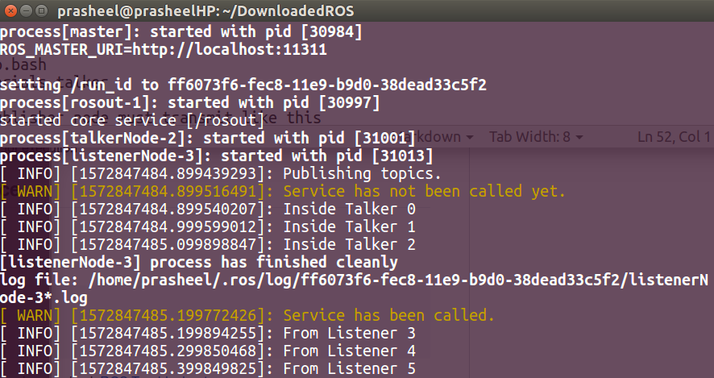

[](https://github.com/Prasheel24/beginner_tutorials/blob/master/License)

## Authors

**Prasheel Renkuntla** - [GitHub](https://github.com/Prasheel24)

## Overview
Beginner Tutorials from the ROS Wiki Page that walks through the Publisher and Subscriber example.

## Description
A beginner tutorial that helps to create a custom ROS package that consists of a publisher, a listener and a service being called from the listener. Once the Master is setup, a talker(talker.cpp) will publish topic with a message. When the service is called from listener, the talker publishes the message accordingly. For each actions, the log is maintained with all 5 levels of logging. A launch file is made to start the nodes at once. The output will be in two terminal screens- 
<p></p>The message published will be "Inside Talker" followed by count
<p></p>Service call from the listener will be invoked.
<p></p>The message after service call, will be subscribed as "From Listener" followed by count

## Demo
<p align="center">
<h5> Services with Talker and Listener </h5>

</p>

## Dependencies	
1. ROS Kinetic - [Installation](http://wiki.ros.org/kinetic/Installation)
2. Catkin(installed by default with ROS) - a low level build system macros and infrastructure for ROS.
3. ROS libraries - std_msgs, roscpp, genmsg(for services)

## Build
Build using the following commands-

```
mkdir -p ~/catkin_ws/src
cd ~/catkin_ws/
catkin_make

source devel/setup.bash
cd src/

git clone --recursive https://github.com/prasheel24/beginner_tutorials
cd ..
catkin_make
```
This will make the workspace and package ready for execution

## Run the program from Launch file
To run the code follow the steps below-

1. Open a terminal to setup the Master Node: 
```
cd ~/catkin_ws
source ./devel/setup.bash
roslaunch beginner_tutorials startAll.launch frequency:=20
```
&nbsp;&nbsp;&nbsp;When frequency is increased, transition of messages to call service can be seen easily.

2. Upon successful execution of the command, there will be two output screens with the output messages from each node.

3. The service will be initialised internally from the listener program which can be seen by transition of messages in the main terminal(where roslaunch was called). (Demo)

## Alternative Method - To run the program at different frequency from individual terminals(without launch)
To run the code follow the steps below-

1. Open a terminal to setup the Master Node: 
```
cd ~/catkin_ws
source ./devel/setup.bash
roscore
```
&nbsp;&nbsp;&nbsp;Ensure if roscore is running in the terminal. For any issues check [ROS Troubleshoot](http://wiki.ros.org/ROS/Troubleshooting)

2. Open a new terminal to setup the Publisher Node: 
```
cd ~/catkin_ws
source ./devel/setup.bash
rosrun beginner_tutorials talker 20
```
</br> Here the integer 20 is the frequency passed as a command line argument based on which the node's frequency will be updated.


## Run the program to start Service
To run the code follow the steps below-

1. Open a terminal to setup the Master Node: 
```
cd ~/catkin_ws
source ./devel/setup.bash
roscore
```
&nbsp;&nbsp;&nbsp;Ensure if roscore is running in the terminal. For any issues check [ROS Troubleshoot](http://wiki.ros.org/ROS/Troubleshooting)

2. Open a new terminal to setup the Publisher Node: 
```
cd ~/catkin_ws
source ./devel/setup.bash
rosrun beginner_tutorials talker
```
&nbsp;&nbsp;&nbsp;Publisher node must transmit like this 
</br>&nbsp;&nbsp;&nbsp;"Service has not been called yet."
</br>&nbsp;&nbsp;&nbsp;"Inside Talker" with count increasing consecutively.

3. Open a new terminal to call the Service:
```
cd ~/catkin_ws
source ./devel/setup.bash
rosservice call /changeOutput "From Service"
```

4. Upon successful execution of the commands, the talker node must show the following message
</br>"Service has been called."
</br>"From Service" with count increasing from the earlier point.

## References
* http://wiki.ros.org/ROS/Tutorials/WritingServiceClient%28c%2B%2B%29
