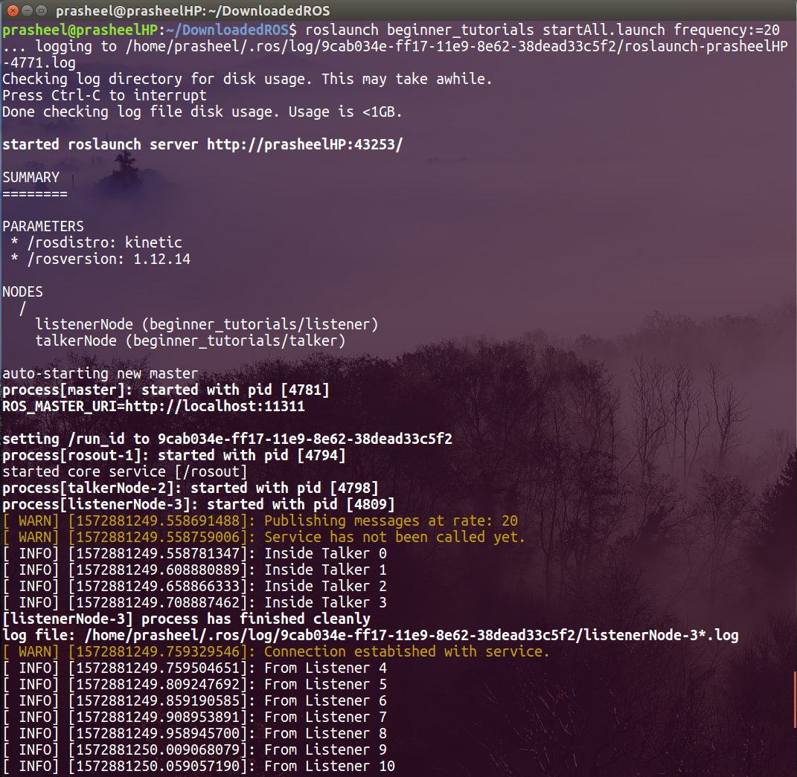
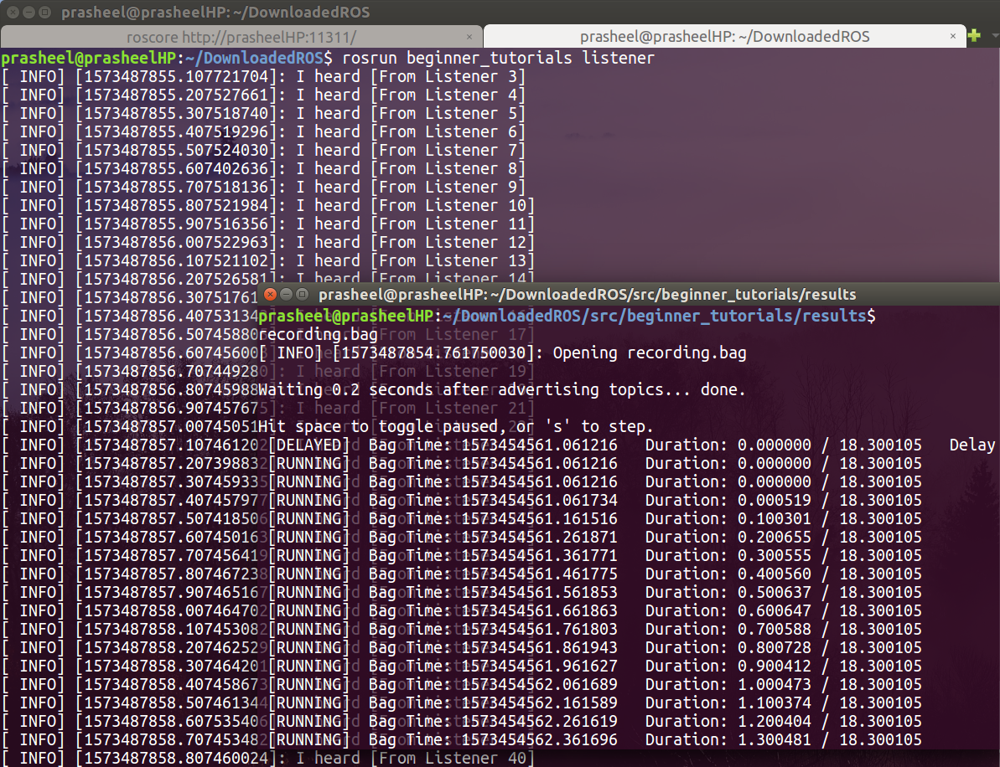

[](https://github.com/Prasheel24/beginner_tutorials/blob/master/License)

## Authors

**Prasheel Renkuntla** - [GitHub](https://github.com/Prasheel24)

## Overview
Beginner Tutorials from the ROS Wiki Page that walks through the Publisher and Subscriber example with TF broadcast and Unit Testing.

## Description
A beginner tutorial that helps to create a custom ROS package that consists of a publisher, a listener, a service from the listener, and a TF broadcaster. Once the Master is setup, a talker(talker.cpp) will publish topic with a message. When the service is called from listener, the talker publishes the message accordingly. For each actions, the log is maintained with all 5 levels of logging. A launch file is made to start the nodes at once. TF will broadcast the frames from "talk". Level 2 Integration testing can be run on the repo. Also, ROSBag is used to examine the output from the services using an argument in launch file.

## Dependencies	
1. ROS Kinetic - [Installation](http://wiki.ros.org/kinetic/Installation)
2. Catkin(installed by default with ROS) - a low level build system macros and infrastructure for ROS.
3. ROS libraries - std_msgs, roscpp, genmsg(for services), tf

## Build
Build using the following commands-

```
mkdir -p ~/catkin_ws/src
cd ~/catkin_ws/
catkin_make

source devel/setup.bash
cd src/

git clone --recursive https://github.com/prasheel24/beginner_tutorials
cd ..
catkin_make
```
This will make the workspace and package ready for execution

## Run the program from Launch file
To run the code follow the steps below-

1. Open a terminal to setup the Master Node: 
```
cd ~/catkin_ws
source ./devel/setup.bash
roslaunch beginner_tutorials startAll.launch frequency:=20
```
&nbsp;&nbsp;&nbsp;When frequency is increased, transition of messages to call service can be seen easily.

2. Upon successful execution of the command, there will be two output screens with the output messages from each node.

3. The service will be initialised internally from the listener program which can be seen by transition of messages in the main terminal(where roslaunch was called). (Demo)

&nbsp;&nbsp;&nbsp;Optional: To run the rqt_console(installed by default) in order to check the logger messages-
```
cd ~/catkin_ws
source ./devel/setup.bash
rqt_console
```

## Alternative Method - To run the program at different frequency from individual terminals(without launch)
To run the code follow the steps below-

1. Open a terminal to setup the Master Node: 
```
cd ~/catkin_ws
source ./devel/setup.bash
roscore
```
&nbsp;&nbsp;&nbsp;Ensure if roscore is running in the terminal. For any issues check [ROS Troubleshoot](http://wiki.ros.org/ROS/Troubleshooting)

2. Open a new terminal to setup the Publisher Node: 
```
cd ~/catkin_ws
source ./devel/setup.bash
rosrun beginner_tutorials talker 20
```
</br> Here the integer 20 is the frequency passed as a command line argument based on which the node's frequency will be updated.


## Run the program to start Service
To run the code follow the steps below-

1. Open a terminal to setup the Master Node: 
```
cd ~/catkin_ws
source ./devel/setup.bash
roscore
```
&nbsp;&nbsp;&nbsp;Ensure if roscore is running in the terminal. For any issues check [ROS Troubleshoot](http://wiki.ros.org/ROS/Troubleshooting)

2. Open a new terminal to setup the Publisher Node: 
```
cd ~/catkin_ws
source ./devel/setup.bash
rosrun beginner_tutorials talker
```
&nbsp;&nbsp;&nbsp;Publisher node must transmit like this 
</br>&nbsp;&nbsp;&nbsp;"Service has not been called yet."
</br>&nbsp;&nbsp;&nbsp;"Inside Talker" with count increasing consecutively.

3. Open a new terminal to call the Service:
```
cd ~/catkin_ws
source ./devel/setup.bash
rosservice call /changeOutput "From Service"
```

4. Upon successful execution of the commands, the talker node must show the following message
</br>"Service has been called."
</br>"From Service" with count increasing from the earlier point.

<p>Following image shows a demo of service</p>
<p align="center">

</p>


## To inspect TF frames
To inspect the TF frames being broadcasted by the talker file, run the following commands.

1. Open a terminal to run the launch file: 
```
cd ~/catkin_ws
source ./devel/setup.bash
roslaunch beginner_tutorials startAll.launch
```

2. Open a new terminal to inspect the TF frames being published: 
```
cd ~/catkin_ws
source ./devel/setup.bash
rosrun tf tf_echo /world /talk
```
The output will be something like this-
```
At time 1573488610.123
- Translation: [0.000, 3.000, 9.000]
- Rotation: in Quaternion [-0.213, 0.426, 0.647, 0.595]
            in RPY (radian) [0.500, 0.900, 1.900]
            in RPY (degree) [28.648, 51.566, 108.862]
At time 1573488610.723
- Translation: [0.000, 3.000, 9.000]
- Rotation: in Quaternion [-0.213, 0.426, 0.647, 0.595]
            in RPY (radian) [0.500, 0.900, 1.900]
            in RPY (degree) [28.648, 51.566, 108.862]
At time 1573488611.723
- Translation: [0.000, 3.000, 9.000]
- Rotation: in Quaternion [-0.213, 0.426, 0.647, 0.595]
            in RPY (radian) [0.500, 0.900, 1.900]
            in RPY (degree) [28.648, 51.566, 108.862]
At time 1573488612.723
- Translation: [0.000, 3.000, 9.000]
- Rotation: in Quaternion [-0.213, 0.426, 0.647, 0.595]
            in RPY (radian) [0.500, 0.900, 1.900]
            in RPY (degree) [28.648, 51.566, 108.862]
```

3. To check the tf_tree run the following command in a new terminal:
```
cd ~/catkin_ws
source ./devel/setup.bash
rosrun rqt_tf_tree rqt_tf_tree
```
&nbsp;&nbsp;&nbsp;The TF tree demo output can be accessed from the results directory (frames.pdf)

## To run ROSTEST
The level 2 Integration tests can be run using the following commands-

Open a terminal to run the test using catkin: 
```
cd ~/catkin_ws
source ./devel/setup.bash
catkin_make run_tests_beginner_tutorials
```
&nbsp;&nbsp;&nbsp;Additionally, the testTalkerRun launch file can be launched.
```
cd ~/catkin_ws
source ./devel/setup.bash
roslaunch beginner_tutorials testTalkerRun.launch
```
<p>Following image shows a demo of ROSTEST in action</p>
<p align="center">

</p>

## To record bag files
ROSBag recording can be done using the following command-
Open a terminal to run the launch file: 
```
cd ~/catkin_ws
source ./devel/setup.bash
roslaunch beginner_tutorials startAll.launch rosbagRecord:=true
```
&nbsp;&nbsp;&nbsp;When the flag(default = false) is true, it will record until SIGINT(ctrl+c) is pressed.

</br>
Following are the steps to examine the recorded bag file
1. Open a terminal to setup the Master Node: 
```
cd ~/catkin_ws
source ./devel/setup.bash
roscore
```
&nbsp;&nbsp;&nbsp;Ensure if roscore is running in the terminal. For any issues check [ROS Troubleshoot](http://wiki.ros.org/ROS/Troubleshooting)

2. Open a new terminal to setup the Listener Node: 
```
cd ~/catkin_ws
source ./devel/setup.bash
rosrun beginner_tutorials listener
```
&nbsp;&nbsp;&nbsp;No output will be displayed, until recording has started.
3. Open a new terminal to play the bag file:
```
cd ~/catkin_ws
source ./devel/setup.bash
cd src/beginner_tutorials/results
rosbag play recording.bag
```
The info on rosbag file can be seen using the following command
```
cd ~/catkin_ws/src/beginner_tutorials/results
rosbag info recording.bag
```
<p>Following image shows a demo of rosbag files played on listener</p>
<p align="center">

</p>

## References
* http://wiki.ros.org/ROS/Tutorials/WritingServiceClient%28c%2B%2B%29
